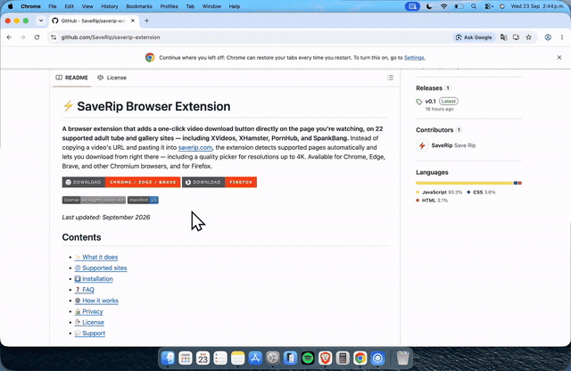

# ⚡ SaveRip Browser Extension

**A browser extension that adds a one-click video download button directly
on the page you're watching, on 22 supported adult tube and gallery
sites — including XVideos, XHamster, PornHub, and SpankBang.** Instead
of copying a video's URL and pasting it into
[saverip.com](https://saverip.com), the extension detects supported pages
automatically and lets you download from right there — including a
quality picker for resolutions up to 4K. Available for Chrome, Edge,
Brave, and other Chromium browsers, and for Firefox.

*Last updated: September 2026*

## Contents

- [✨ What it does](#what-it-does)
- [🌐 Supported sites](#supported-sites)
- [⬇️ Installation](#installation)
- [❓ FAQ](#faq)
- [⚙️ How it works](#how-it-works)
- [🔒 Privacy](#privacy)
- [📄 License](#license)
- [💬 Support](#support)

## ✨ What it does

- **One-click download** — a floating button appears on any video page on
  a supported site, no URL copy-pasting required.
- **Quality picker** — choose the exact resolution (up to 4K, where the
  source offers it) instead of always getting whatever's best-allowed.
- **Account popup** — check your remaining free downloads, your Pro plan
  status, and manage your subscription without leaving the page.
- **Downloads survive navigation** — close the tab or browse to another
  page before a download finishes, and it still lands in your Downloads
  folder.
- **Five languages** — English, Spanish, German, French, and Portuguese,
  matched automatically to your browser's language.
- **Tuck it away** — collapse the button into a small tab docked to the
  edge of the page when you don't want it in view, and bring it back
  with one click.

Free accounts get a limited number of downloads every 4 hours. A
[SaveRip Pro](https://saverip.com/pricing/) subscription removes the
limit and unlocks higher resolutions and faster download speeds.

## 🌐 [Supported sites](https://saverip.com/supported-sites/)

22 sites as of this writing — the registry that drives both this
extension and [saverip.com](https://saverip.com) is auto-discovered, so
new sites get added over time without changing the extension's core code.

| | | |
|---|---|---|
| Amateur8 | HDZog | PornZog |
| Beeg | HeavyFetish | SpankBang |
| EPorner | HQporner | TNAFlix |
| EroMe | MilfCaps | TXXX |
| FetishPapa | PornHub | Upornia |
| xFantazy | PornOne | xHamster |
| XNXX | PornPics | XVideos |
| PornTrex | | |

Don't see a site you use? [Let us know](mailto:support@saverip.com) —
new scrapers get added regularly.

## ⬇️ Installation

This extension isn't distributed through the Chrome Web Store: its
content category doesn't qualify for that store's listing policy. It's
self-hosted instead, the same way a growing number of adult-content and
niche browser extensions are distributed outside official stores.

**Chrome, Edge, Brave, and other Chromium browsers:**
1. [Download](https://github.com/SaveRip/saverip-extension/releases/latest/download/saverip-extension-chrome-v0.1.3.zip) and unzip the latest release.
2. Open `chrome://extensions` and enable **Developer mode** (top right
   toggle).
3. Click **Load unpacked** and select the unzipped folder.

**Firefox:**
1. [Download](https://github.com/SaveRip/saverip-extension/releases/latest/download/saverip-extension-firefox-v0.1.3.xpi) the latest signed `.xpi` release.
2. Open it in Firefox — drag the file into a browser tab, or use
   `File → Open File`.
3. Approve the permissions prompt.

Firefox doesn't need developer mode: the `.xpi` is signed by Mozilla for
self-distribution, so it installs like any other add-on.

## ❓ FAQ

**Is this extension free?**
Yes, installing and using it is free. It uses your existing SaveRip
account — free-tier limits and Pro benefits are the same as on the
website.

**Does this work as an XHamster or XVideos download extension?**
Yes — those are two of the 22 supported sites (see [Supported
sites](#supported-sites) for the full list, including PornHub and
SpankBang). The download button appears automatically on any video page
from a supported site, no separate setup per site required.

**Why isn't this on the Chrome Web Store or Firefox's public add-on
listing?**
Both official stores restrict extensions in this content category. The
extension is still fully functional installed manually (see
Installation above) — you're just not browsing for it inside the store's
own search.

**Is it safe to load an extension outside the Chrome Web Store?**
The source code in this repository is exactly what gets packaged for
release — nothing is obfuscated or minified, so you (or anyone) can read
every line before installing. The Firefox build also goes through
Mozilla's independent signing process, which requires passing their
automated review before a `.xpi` gets signed.

**Does it work on Firefox and Chrome the same way?**
Functionally yes. The only difference is internal: Chrome (Manifest V3)
uses a service worker in the background, while Firefox uses a background
script instead, since its Manifest V3 support doesn't yet cover service
workers the same way.

**Does it collect my browsing history?**
No. It only sends the specific page URL to the API when you click
download — see [Privacy](#privacy) below for the full breakdown.

**How do I get 4K downloads?**
The quality picker shows every resolution a source actually offers.
Whether 4K is available depends on the source video, not on the
extension — free accounts are capped at a lower resolution, Pro
accounts aren't.

## ⚙️ How it works

| File | Role |
|---|---|
| `background.js` | The only part of the extension that talks to the SaveRip API. A Manifest V3 service worker (with a `background.scripts` fallback for Firefox). |
| `content-script.js` | Runs on supported sites, detects whether the current page is a video, and renders the inline download widget. |
| `login-bridge.js` | Syncs your login session from the website into the extension automatically, so you don't have to log in twice. |
| `popup/` | The toolbar popup — account status, quota, active downloads, and quality preference. |
| `shared/config.js` | Constants and translated copy shared across all of the above. |

## 🔒 Privacy

This extension is covered by SaveRip's privacy policy, including a
section specific to what the extension itself does with your data:
[saverip.com/privacy/#extension](https://saverip.com/privacy/#extension).

In short: your login token stays on your device and is only ever sent to
`saverip.com`; the extension doesn't collect or transmit your general
browsing history, only the specific page you click "download" on.

## 📄 License

Copyright © 2026 SaveRip. All Rights Reserved.

The source code is published here for transparency, so you can read
exactly what the extension does before installing it — it's not open
source. Copying, modifying, or redistributing this code isn't permitted
without permission. Downloading and using the packaged releases (the
`.zip`/`.xpi` files in [Releases](../../releases)) to install and run the
extension is fine. See [LICENSE](LICENSE) for the full terms.

## 💬 Support

Questions or issues: [support@saverip.com](mailto:support@saverip.com)
